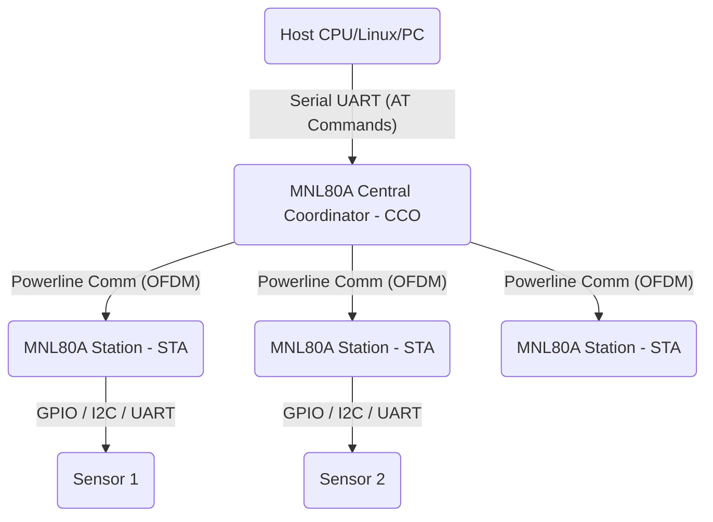

# MNL80A PLC Module Python Library


A professional, feature-rich Python wrapper for the **Jiaxun MNL80A** (JMN-L80A) PLC (Power Line Communication) IoT Module AT Command Set. This library allows you to effortlessly integrate robust PLC communication into embedded Linux devices, Raspberry Pi, or any Python-capable host using highly reliable serial communication.

---

## 🚀 Features

- **Full AT Command Support**: Wrappers for Topology querying, Data Transmission, GPIO control, and more.
- **Asynchronous Event Handling**: Listen for `+READY`, `+ONLINE`, and `+RECV` events seamlessly in the background without blocking your main thread.
- **Robust Serial Client**: Configurable timeout, baud rate, and robust error handling.
- **Easy Integration**: Installable via pip, heavily documented.

## 🛠 Hardware Specifications (JMN-L80A)

- **Processor**: High-performance Cortex-M3 (200MHz)
- **Modulation**: OFDM / FSK (Duplexing)
- **Networking**: Fast auto-networking (up to 200 nodes within 10s)
- **Interfaces**: UART, PWM, GPIO, ADC, SPI, I2C
- **Operating Voltage**: 3.3V DC
- **Communication Rate**: PHY layer peak 0.507Mbps / App layer 80Kbps.

## 📦 Installation

To install this package locally:

```bash
git clone https://github.com/yourusername/MNL80A.git
cd MNL80A
pip install .
```

## 💻 Usage Example

```python
import time
from mnl80a.client import MNL80AClient
from mnl80a.commands import MNL80ACommands

# Initialize the client (replace /dev/ttyS0 with your serial port)
client = MNL80AClient(port='/dev/ttyS0', baudrate=115200)
mnl80a = MNL80ACommands(client)

# Register callbacks
client.on_online = lambda mac: print(f"Device ONLINE: {mac}")
client.on_recv = lambda mac, leng, data, flag: print(f"Received from {mac}: {data}")

# Start background listener
client.start_listening()

# Run commands
version = mnl80a.get_software_version()
print(f"Firmware: {version}")

# Transmit Data
mnl80a.send_data("0000C0A80110", "Hello PLC User!")

time.sleep(10)
client.close()
```

## 🏗 Architecture & Topology

The MNL80A module operates in one of two distinct forms in a network.



## 📚 SDK Compilation (Linux Build Manual)
If you intend to modify the firmware on the embedded ARM Cortex-M3 within the module, you MUST use the provided Linux DW21V100 compilation environment.

**Requirements**: 
- `Ubuntu 18.04.2 LTS`
- `gcc-arm-none-eabi-10.3-2021.07`
- Make, CMake, and Python3.

**Basic Compile Steps**:
1. Copy the arm-gcc compiler to `tools/toolchains/gcc-arm-none-eabi-10.3-2021.07`.
2. Enter the source build directory: `cd build`
3. Generate the password key using the MakePwdNVTool.
4. Execute `python3 build.py -t=cco,sta` to build the required release versions in the `output/` directory.

## 🤝 Contributing
Contributions, issues and feature requests are welcome. Feel free to check the issues page before contributing. See `CONTRIBUTING.md` for details.

## 📄 License
This project is [MIT](LICENSE) licensed.
